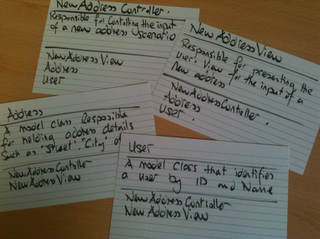

CompSci 308: Game Project Analysis
===================

> This is the link to the [assignment](http://www.cs.duke.edu/courses/compsci308/current/assign/01_game/):

Design Review
=======

### Status

* Code Readability:
    * In my opinion, the code is fairly easy to read but definitely has room for improvement.  I gave methods names 
    that describe exactly what they do and gave variables descriptive names.  I also kept my methods short, for the 
    most part, only calling helper methods that handle one task at a time.  The code is well commented where comments
     are appropriate, but does not need many comments to be understandable.  Here is an example of code from my 
     MainScreen class that I find to be very readable seeing as every method explains exactly what it is doing.
     
     ```java
  protected void setUpScene(int width, int height, Paint background) {
          StackPane root = new StackPane();
          var scene = new Scene(root, width, height, background);
         
          initializeWelcomeScreenBackground();
          initializePaddle();
          initializeWelcomeText();
         
          createButtons();
         
          addSceneElementsToVBox();
         
          root.getChildren().add(welcomeScreenBackground);
          root.getChildren().add(myVBox);
         
          myScene = scene;
         
  }
     ```
     * On the other hand, there is still code with room for improvement when it comes to readability.  I think this 
     is particularly the case when I am using if statements and logic to control flow.  For example, in my GameLevel 
     class I have a step function that advances the game animation.  How the step function works depends on if the 
     game is in active mode (meaning the Bouncer should be moving) and if a power up animation is being played or not
     .  Currently, this is how my step function handles the logiic:
     
     ```java
  /**
       * Handles the animation of the level
       * Allows for pausing based on whether the game is in a moment where time needs to freeze or behave
       * differently based on what powerups are being used
       * Updates all important aspects of the level
       * @param elapsedTime
       */
      @Override
      protected void step (double elapsedTime) {
          // update attributes
          if (activeGameMode && !myPowerUpManager.isInDestroyMode() && !myPowerUpManager.isInBallDropperMode()) {
              timeRemaining -= elapsedTime;
              myPaddle.updatePaddlePosition(elapsedTime,myScene);
              List<GenericBrick> effectedBricks = myBouncer.handleBouncerCollisions(elapsedTime,myScene, myPaddle, myBricks,
                      root);
              cleanUpBricksAndCollectPowerUps(effectedBricks);
              myPowerUpManager.updatePowerUpStatus(elapsedTime);
  
              handleLifeLoss();
              handleEndOfGame();
          }
          myPowerUpManager.handleBallDropperMode(elapsedTime);
          playerScore = myBrickManager.getMyScore();
          centerHBoxText(bottomLineDisplay, myScene.getHeight()* BOTTOM_LINE_DISPLAY_LOCATION, myScene);
          updateTopLine();
          myPowerUpManager.displayStateOfPowerUps();
      }
    ```
    * Not only is this method long, but it depends on logic that may not be necessarily apparent and readable.  This 
    code should be refactored possibly into two methods.  One method would hand the general game animation and the 
    other would handle the animation if the game is in some special mode where the animation is different.  
    Alternatively, I could refactor my PowerUpManager class to be able to handle the animation whenever a power-up is
     in use which could separate the functionality so my step function within the GameLevel class would be easier to 
     follow.  An example of the basic pseudocode for this refactoring is shown below:
     
     ```java
     protected void step (double elapsedTime) {
               // update attributes
               if (myPowerUpManager.isUsingPowerUp()) {
                 myPowerUpManager.handleAnimation(elapsedTime);
               } 
               else if (inActiveMode){
                 handleAnimation(elapsedTime);
               }
  }
     ```
* Handling of Dependencies
    * In general, the dependencies in my code are rather convoluted due to poor design.  Instead of creating classes 
    that are closed to modification and can stand alone, many of the classes are interdependent.  There are two 
    really egregious examples of these interdependencies.  The first is in how I utilize my StageManager class. I 
    designed the StageManager as a way to be able to change scenes from any Screen to another Screen.  However, this 
    means that each Screen needed to be passed the StageManager and that the StageManager needed to be able to 
    initialize Screens.  This lead to the following circular dependencies that can be seen in the StageManager 
    constructor:
    
    ```java
    /**
         * StageManager Constructor creates the StageManager and initializes all screens being managed
         * Sets the currentScreen to a GenericScreen in teh beginning.
         * @param stage
         */
        public StageManager(Stage stage) {
            this.mainScreen = new MainScreen(this);
            this.gameLevel = new GameLevel(this,1,GameDifficulty.BEGINNING_MODE);
            this.pauseScreen = new PauseScreen(this);
            this.cheatKeyMode = new CheatKeyMode(this);
            this.tutorialMode = new TutorialMode(this);
            this.stage = stage;
            this.currentScreen = new GenericScreen();
            stage.setScene(currentScreen.getMyScene()); 
        }
  ```
  * I am sure that passing itself as the parameter to initialize another object in its constructor is a huge 
  malpractice but I was unsure of any other way to get the same functionality other than constantly adding and 
  removing objects from the root's children every time I wanted to make a sweeping change of what was being displayed.
     


You can also make lists:

* Bullets are made with asterisks

1. You can order things with numbers.


Emphasis, aka italics, with *asterisks* or _underscores_.

Strong emphasis, aka bold, with **asterisks** or __underscores__.

Combined emphasis with **asterisks and _underscores_**.


You can put links to commits like this: [My favorite commit](https://coursework.cs.duke.edu/compsci308_2019spring/example_bins/commit/ae099c4aa864e61bccb408b285e8efb607695aa2)


### Design

You can put blocks of code in here like this:
```java
    /**
     * Returns sum of all values in given list.
     */
    public int getTotal (Collection<Integer> data) {
        int total = 0;
        for (int d : data) {
            total += d;
        }
        return total;
    }
```

### Alternate Designs

Here is another way to look at my design:



