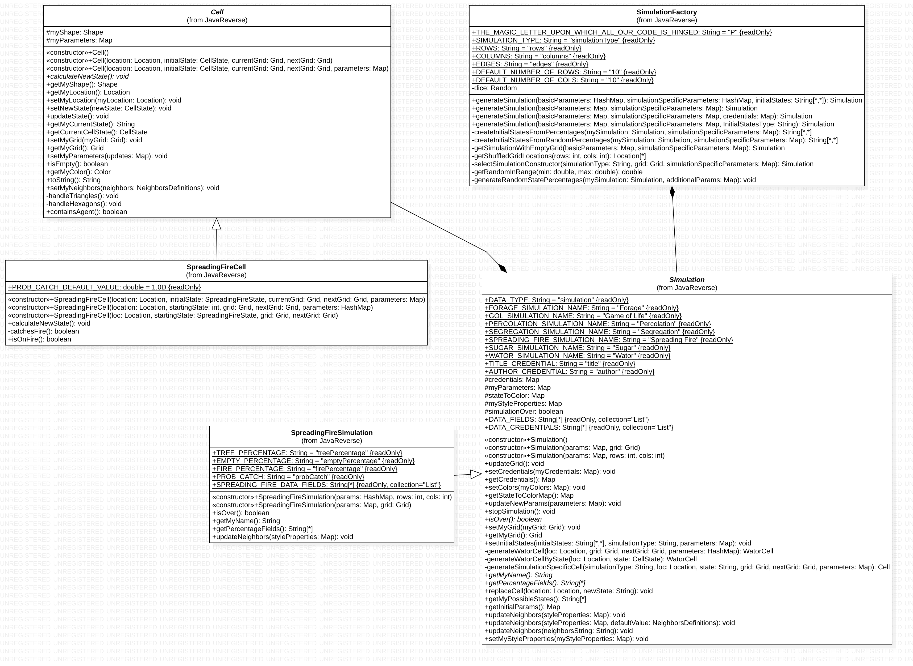

CompSci 308: Simulation Project Analysis
===================

> This is the link to the [assignment](http://www.cs.duke.edu/courses/compsci308/current/assign/02_simulation/):


Design Review
=======

### Overall Design

* High Level Design
    * Simulation is the backend of the project where the logic of what to display takes place.  The Simulation 
    abstract class and the concrete classes that extend from it are used to communicate information from the 
    configuration and visualization to the backend (simulation).  At the heart of the simulation are the cells that 
    are all subclasses of our abstract Cell class.  The cells implement the rules of the simulation to update their 
    states.  Each simulation has an Enum that enumerates the possible states for that simulation and the cell will 
    update itself to its next state using its current state and the rules of the simulation.  Another important 
    component of the simulation is the grid which is an object implementing the Grid interface.  The cells are able 
    to access the grid and are store in the grid.  The grid allows cells to find its neighbors (based on the cells 
    NeighborsType).  The grid is also able to add and remove cells to the grid and pass information about the cells 
    in aggregate to the visualization so they can be displayed.
    * Configuration communicates to the simulation by using our Simulation Factory which takes in the basic 
    parameters of a simulation (the grid size, grid type, and simulation name) to create a grid for the simulation to
     initialize a simulation with an empty grid.  The configuration then calls a method on its newly created 
     simulation to set the initial states of all the cells in the simulation.  This can be done with explicitly 
     defined states read in from the XML file or by using random states or just defining the percentages you want of 
     each kind of cell.  The XML parser class is used to extract the backend information from the XML file and to 
     create a new simulation and pass it the initial states. Configuration communicates information about the style of 
     the cells (how colors correspond to states, the shapes of the cells, etc.) to the visualization by the visualization creating a new XMLStyler and
      reading in one of our default style files.
    * Visualization creates a Simulation and can use this simulation object to get information about the cells.  Once
     the visualization has information about the cells, it is able to display the cells in a grid based on the cell 
     location, state (with a map of state to color passed from the styler), shape, etc.  The visualization has 
     several panels and buttons.  The panels are specific to each simulation and are displayed only when that 
     simulation type is running.  The panels can be used by the user to change parameters for the simulation in real 
     time.  These parameter changes are then updated in the back end using the simulation class as an intermediary 
     that passes a map of parameter changes from the GUI to the cells (that actually implement the rules based on the
      parameters).  When visualization wants to create a new simulation, it creates an XMLParser and will pass it the
       parameters set in the panel of basic controls (such as number of columns) as well as the simulation specific 
       parameters (such as % empty cells).  The XMLParser will then create a new simulation that can be used to 
       communicate back and forth between the backend and frontend.  
       
* Adding a New Simulation
    * Simulation:
        * Create an Enum enumerating all the possible states a cell in the new simulation can have.
        * Make sure the enum you create implements the CellState interace
        * Create a simulation specific cell that is extends Cell
        * Implement the abstract methods and override any methods that differ from the basic implementations given in
         the Cell abstract class
        * The rules of the simulation should be implemented in the specific cell class you create for the simulation
        * Create any agents that may be involved in the simulation (eg. SugarAgent, ForageAnt, etc)
        * Create a simulation specific simulation class that extends Simulation
        * Implement the abstract methods and override any necessary methods
        * In the simulation class, define the percentage fields corresponding to the different states in your enum in
         the form of "statenamePercentage"
        * In the simulation class, be sure to identify the data fields used in your simulation with strings that are 
        going to match the tags you want to look for in the XML file
        * Add this simulation and cell type to the possibilities in the SimulationFactory
    * Configuration:
        * Add the new simulation as a case to the getSimulationStates and getSimulationDataFields of the XMLParser
        * Create the XML files for the simulation based on the tag names you specified in the DataFields for this 
        simulation
    * Visualization:
        * Create a side panel for the simulation
        * Add the simulation as an option
    
* Dependencies:
    * The dependencies are clear and easy to find.  The configuration communicates to the simulation via a 
    SimulationFactory. Simulation and Visualization communicate to one another via methods in the Simulation's external 
    API.  Visualization gets information from configuration by creating an XMLParser object.
    
* One Feature I did not Implement:
    * Readability:
    * Encapsulation:
    * Design:

* Code Consistency:
    

    

    

1. You can order things with numbers.

You can put links to commits like this: [My favorite commit](https://coursework.cs.duke.edu/compsci308_2019spring/example_bins/commit/ae099c4aa864e61bccb408b285e8efb607695aa2)


### Your Design

* High Level Design:
    * Simulation is the backend of the project where the logic of what to display takes place.  The Simulation 
    abstract class and the concrete classes that extend from it are used to communicate information from the 
    configuration and visualization to the backend (simulation).  At the heart of the simulation are the cells that 
    are all subclasses of our abstract Cell class.  The cells implement the rules of the simulation to update their 
    states.  Each simulation has an Enum that enumerates the possible states for that simulation and the cell will 
    update itself to its next state using its current state and the rules of the simulation.  Another important 
    component of the simulation is the grid which is an object implementing the Grid interface.  The cells are able 
    to access the grid and are store in the grid.  The grid allows cells to find its neighbors (based on the cells 
    NeighborsType).  The grid is also able to add and remove cells to the grid and pass information back and forth 
    between visualization and the cells that are implementing the rules.  Simulation classes can communicate
* Design Checklist Issues:
    * Static Variables:
        * There is one static variable I use and the logic behind it is documented with a comment above it.  In the 
        Sugar simulation, the darkness of a cell is dependent on the maximum amount of sugar allowable on any cell.  
        Since all sugar patch cells need to know about this number and be able to access and update it, I used the 
        approach shown in the Wator source code we were given to use a static variable to access this globally shared
         state among the SugarPatches instead of passing the information to the simulation from each of the patches 
         and then passing it back to the patches because I didn't think the simulation should have to know about 
         something that only really involves the cells.  If this is bad design it could easily be fixed by a method 
         in the Simulation that would calculate the max amount allowable by any of the cells and then pass it to all 
         the cells.
    * Warnings from compiler:
        * We have deprecated methods that give compiler warnings.  The methods are no longer used and we could just 
        delete them if it is an issues but we wanted to leave them in just in case we wanted to revert back to an 
        older design easily.
    * Superclasses:
        * The Cell abstract class contains instance variables that are used by most of the simulations but not 
        necessarily all of them.  I thought it was better to have a couple go unused in a simulation here or there 
        than to have to repeatedly include all the variables in each simulation.  This could easily be fixed with 
        refactoring if we had more time.
    * Repeated Code:
        * The one area in which there is repeated code is in the Enums where there is a method to get the possible 
        states of that enum as a string.  I did not know how to resolve this instance of repeated code though because
         Enums cannot extend each other so I could not create a super enum with the method implemented and extend 
         from it.  I also can't implement a method in an interface.  One possible solution would be to implement this
          method in the Cell class itself and then use the fact that every cell has some enum that is the current 
          cell state to be able to get all the possible states as strings.
    * Down Casting:
        * The Forage Simulation has a lot of ForagePatch-specific methods that are not common to all cells so I am 
        consistently having to downcast the cells returned by the grid to a ForagePatch so I can call the appropriate
         methods.  We made this design choice because it seemed better to down cast in one simulation that for 
         visualization to have to check what kind of cell it has to display.
        * This problem could be fixed by using a CellVisualizer interface rather than an abstract class for Cell.  
        Therefore each of the cells would have to implement the specific methods called by visualization but could 
        have different functionality specific to their own simulations
        * Additionally, we possibly could have had a grid hierarchy where each simulation gets a grid that only 
        contains the cells corresponding to that simulation, all of course implementing the necessary methods that 
        get called by visualization to be able to display.
* Good Feature
* Bad Feature

You can put blocks of code in here like this:
```java
    /**
     * Returns sum of all values in given list.
     */
    public int getTotal (Collection<Integer> data) {
        int total = 0;
        for (int d : data) {
            total += d;
        }
        return total;
    }
```


### Flexibilty

* What makes the code flexible or not?

* Describe two features you did not implement:
    * Good Feature: XML Parsing
        * The XMLParser hierarchy allows for any type of simulation to be read in using only two subclasses of XMLParserGeneral, one that handles reading in any XML Style file and one that handles reading the XML Simulation file. Since the XMLParser depends on the names of data fields defined in the Simulation’s class, and a consistent set of tag names for fields used across simulations, adding a simulation will not require any new code or changes in any of the XML parsing classes. There are separate methods in each of the parser subclasses that parse each of the individual fields in the file. This way, if any one input type were to be changed, for example initial states is now a map instead of a list of states, then only that one method responsible for parsing initial states would need to change. The hierarchy also reduces redundant code by creating subclasses that handle the 2 categories of XML files expected: the style file and the simulation file.
    * Bad Feature: Transfer of Information from Front End to Back End
        * This code is interesting because it shows the pitfalls of the way we transfer information between frontend 
        to backend.In general, information that is necessary to be reset is organized poorly. Between the simulation panels, the default panel, and the GUIGridOptions, it is difficult to synthesize the information in a manner that can be passed back to Simulation or to Configuration. This requires chains of method calls and non-intuitive fields in particular classes. For example in GUIGridCell, the cell needs a Simulation field in order to pass back a new state for a cell if a user clicks on it. It would be quite difficult to get the grid to display more than two grids or for the two to show different simulations. These two classes combined require GUIGrid, Simulation, GUISimulationPanel, GUIDefaultPanel, SimulationFactory, GUIChart, and GUISimulationFactory. This is evidence that there is something inherently wrong with this design and probably needs to be refactored into the various jobs both accomplish. If there was another source of information (say, a window was keeping track of the order of simulations, or the duration of each simulation), it is not clear how it could be cleanly implemented to pass and store this information.


### Alternate Designs

Here is a graphical look at a sample (Spreading Fire) of my design:




made from [a tool that generates UML from existing code](http://staruml.io/).


### Conclusions

